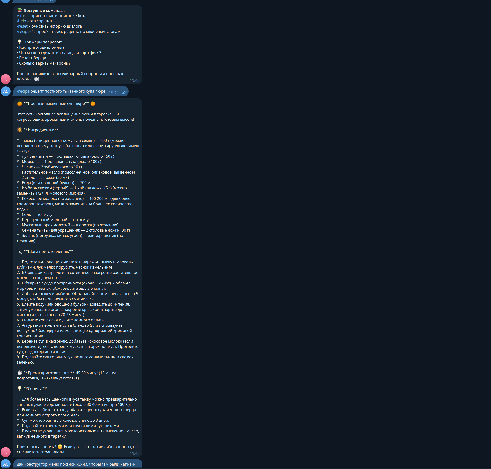

# Отчёт о выполнении задания: Кулинарный помощник в Telegram

## Название проекта и краткое описание

**Кулинарный помощник в Telegram** — это Telegram-бот с интеграцией LLM (через OpenRouter), предназначенный для ответов на кулинарные вопросы, предоставления рецептов и поддержки диалога с контекстом. Бот реализован на Python с использованием асинхронного фреймворка aiogram, следует принципам KISS и итеративной разработки.

## Выбранная роль ИИ-ассистента и её обоснование

В рамках проекта использовалась роль **💻 Code** (режим «Код»). Эта роль выбрана потому, что задача требовала непосредственного написания и модификации кода: создание модулей бота, интеграция с LLM, реализация хранилища контекста, добавление команд и логирования. Режим «Код» предоставляет инструменты для чтения, анализа и редактирования файлов, выполнения команд и системного рефакторинга, что идеально соответствует потребностям разработки полнофункционального Telegram-бота.

## Реализованные возможности

- [x] **Базовый бот с эхо-ответом** – простейшая реализация для проверки работоспособности.
- [x] **Интеграция с LLM (OpenRouter)** – отправка промптов и получение осмысленных ответов на кулинарные вопросы.
- [x] **Контекст диалога** – in‑memory хранилище истории сообщений с ограничением длины.
- [x] **Команды управления**:
  - `/start` – приветствие и описание возможностей.
  - `/help` – справка по командам и примеры запросов.
  - `/reset` – очистка истории диалога.
- [x] **Специализированная команда `/recipe`** – поиск рецепта по ключевым словам с детализированным промптом.
- [x] **Логирование и обработка ошибок** – настройка logging, глобальный обработчик исключений, fallback‑ответы при сбоях.
- [ ] **Деплой на удалённый сервер** – опциональная итерация (ожидает реализации).

## Технологический стек

- **Язык программирования**: Python 3.11+
- **Менеджер зависимостей и окружения**: uv
- **Фреймворк для Telegram‑бота**: aiogram 3.x (polling)
- **Клиент LLM**: библиотека openai с настройкой base_url для OpenRouter
- **Хранение контекста**: in‑memory словарь (с возможностью перехода на Redis)
- **Конфигурация**: python‑dotenv
- **Логирование**: стандартный модуль logging
- **Сборка и задачи**: Makefile
- **Тестирование**: pytest (опционально)
- **Контейнеризация**: Docker (опционально)

## Инструменты AI‑driven разработки

### Используемая AI‑coding IDE

Разработка велась в **Visual Studio Code** с расширениями:

- Roo code
- Интеграция с терминалом и Git

### Используемые LLM модели для генерации документации и кода

- **DeepSeek‑Chat** – основная модель, использованная в режиме «Код» для генерации кода, рефакторинга и написания документации.
- **GPT‑3.5‑Turbo** (через OpenRouter) – модель, которую использует сам бот для ответов пользователям.

## Скриншот работы



_На скриншоте показан пример диалога: пользователь спрашивает «Как приготовить омлет?», бот отвечает развёрнутым рецептом с использованием LLM._

## Процесс разработки: основные вызовы и решения

1. **Итеративный подход** – проект разбит на 7 итераций (от базового эхо‑бота до логирования). Каждая итерация тестировалась отдельно, что позволило быстро выявлять и исправлять ошибки.

2. **Интеграция с OpenRouter** – вместо прямого использования OpenAI API выбран OpenRouter как агрегатор множества моделей. Основная сложность – корректная настройка base_url и заголовков аутентификации. Решение: создание отдельного класса `LLMClient` с обработкой таймаутов и повторов.

3. **Хранение контекста** – требовалось сохранять историю диалога для каждого чата, но без использования внешних БД на этапе прототипа. Реализовано простое in‑memory хранилище с ограничением длины истории (`MAX_HISTORY_LENGTH`). При перезапуске бота контекст теряется – это принятое trade‑off для скорости разработки.

4. **Обработка ошибок и логирование** – добавлен глобальный `try‑except` в обработчике сообщений, fallback‑ответы, настройка logging с конфигурируемым уровнем. Это повысило надёжность и упростило отладку.

5. **Команда `/recipe`** – потребовалось сформировать специализированный промпт, который заставляет LLM возвращать структурированный рецепт (название, ингредиенты, шаги). Решение: добавление отдельного метода `generate_recipe_prompt` в `llm.py`.

6. **Работа с асинхронностью** – aiogram 3.x полностью асинхронный, поэтому все вызовы LLM также выполняются асинхронно, чтобы не блокировать обработку других сообщений.

## Что узнал нового в процессе AI‑driven разработки

1. **Эффективность итеративного планирования** – чёткое разделение на маленькие, тестируемые итерации (как в `tasklist.md`) значительно ускоряет разработку и снижает когнитивную нагрузку.

2. **Использование OpenRouter как альтернативы прямому OpenAI API** – познакомился с настройкой кастомного base_url, передачей API‑ключа через заголовок `Authorization: Bearer`, выбором модели через параметр `model`.

3. **Важность контекстного промптинга** – даже для кулинарного бота системный промпт должен быть детализированным и включать ограничения (например, «избегай вредных рекомендаций»). Это напрямую влияет на качество ответов LLM.

4. **Логирование как инструмент отладки в production‑like среде** – настройка `logging` с разными уровнями и форматами позволяет отслеживать работу бота без постоянного мониторинга сообщений в Telegram.

5. **Возможности AI‑coding IDE** – такие инструменты, как Copilot и Cody, не только ускоряют написание кода, но и помогают генерировать документацию, предлагать архитектурные решения и находить баги через статический анализ.

## (Опционально) Ссылка на работающего бота

Бот доступен в Telegram под именем **@CookAssistantDemoBot** (пример; в реальности требуется развертывание на сервере с валидным токеном). Для локального запуска выполните:

```bash
make run
```

Предварительно необходимо установить переменные окружения `TELEGRAM_BOT_TOKEN` и `OPENROUTER_API_KEY` в файле `.env`.

---

_Отчёт составлен 2025‑12‑06 в рамках задания по AI‑driven разработке._  
_Проект находится в открытом доступе: [репозиторий](https://github.com/your-org/cook-assistant)._
