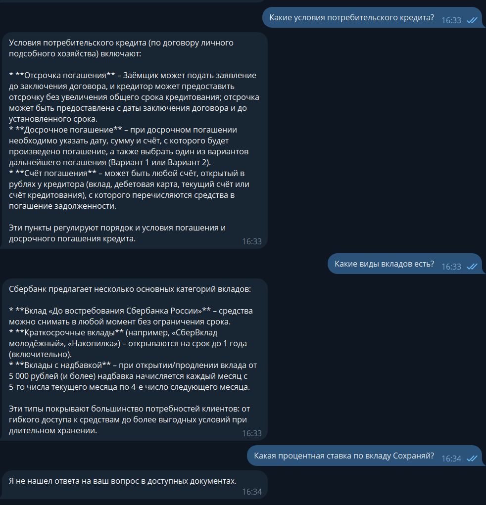
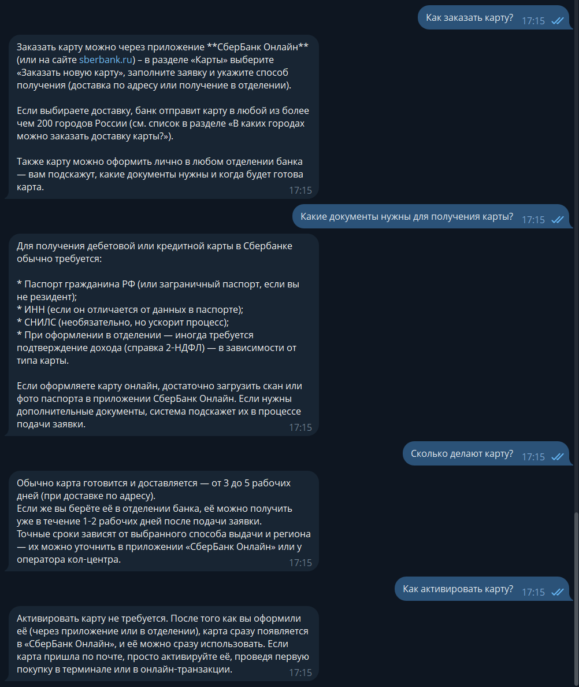
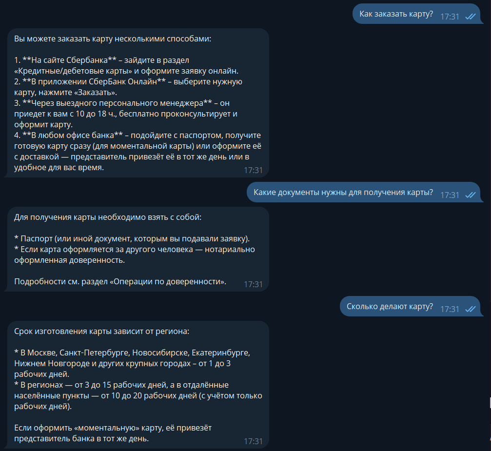

# Отчёт по выполнению задания: RAG-ассистент Сбербанка

## Название проекта и краткое описание

**RAG-ассистент Сбербанка** — Telegram-бот с использованием Retrieval-Augmented Generation (RAG) для ответов на вопросы по документам Сбербанка о кредитах и вкладах. Бот индексирует PDF-документы и JSON-датасет с вопросами-ответами, выполняет семантический поиск и генерирует ответы на основе извлечённого контекста.

## Вариант задания

**Базовый вариант** — реализована основная функциональность RAG с индексацией PDF и JSON, интеграцией в Telegram-бота, экспериментированием с размерами чанков и сравнением моделей эмбеддингов.

## Реализованные возможности

- [x] Освоить построение RAG-систем с использованием LangChain
- [x] Научиться индексировать документы и работать с векторными хранилищами
- [x] Экспериментировать с различными стратегиями разбиения документов на чанки
- [x] Работать с различными типами данных (PDF и JSON)
- [x] Интегрировать RAG в Telegram-бота
- [x] Реализовать контекстный диалог с учётом истории (query transformation)
- [x] Настроить асинхронную обработку запросов
- [x] Добавить логирование работы бота

## Технологический стек

- **Язык программирования**: Python 3.11+
- **Менеджер зависимостей**: uv
- **Фреймворк для бота**: aiogram 3.x
- **RAG-фреймворк**: LangChain
- **Интеграция с LLM**: langchain-openai (OpenAI-совместимые API)
- **Загрузка документов**: PyPDF (PDF), JSONLoader (JSON)
- **Векторное хранилище**: InMemoryVectorStore (LangChain)
- **Эмбеддинги**: OllamaEmbeddings / OpenAIEmbeddings
- **Конфигурация**: python-dotenv (.env файлы)
- **Логирование**: стандартный модуль logging
- **Автоматизация**: Makefile

## Используемые модели

### Модели для генерации ответов

- **Основная LLM**: `accounts/fireworks/models/gpt-oss-120b` (через Fireworks API)
- **LLM для трансформации запросов**: `accounts/fireworks/models/gpt-oss-120b`

### Модели эмбеддингов (тестировались)

1. **Fireworks**: `accounts/fireworks/models/qwen3-embedding-8b`
2. **Ollama**: `aroxima/multilingual-e5-large-instruct:latest` (локальная)

### Альтернативные провайдеры (поддерживаются конфигурацией)

- **OpenRouter**: `openai/gpt-oss-20b:free` (LLM), `openai/text-embedding-3-large` (эмбеддинги)

---

## 1. Эксперименты с индексацией

### Описание экспериментов

Проведено три теста с разными параметрами разбиения документов на чанки:

- **Эксперимент 1**: Базовые параметры (`chunk_size=500`, `chunk_overlap=50`) с сепараторами по умолчанию.
- **Эксперимент 2**: Увеличенные чанки (`chunk_size=1500`, `chunk_overlap=150`) с сепараторами по умолчанию.
- **Эксперимент 3**: Компромиссные параметры с кастомными сепараторами (`chunk_size=800`, `chunk_overlap=100`, сепараторы `["\n\n\n", "\n\n", "\n", ". ", " ", ""]`, `keep_separator=True`).

Цель: оценить влияние размера чанков и стратегии разделения на качество ответов RAG для банковских документов (PDF‑файлы с условиями кредитов и вкладов).

### Количественные результаты

| Параметры                        | Количество чанков | Изменение относительно базового |
| -------------------------------- | ----------------- | ------------------------------- |
| `500/50` (база)                  | 377               | —                               |
| `1500/150`                       | 132               | –65%                            |
| `800/100` (кастомные сепараторы) | 246               | –35%                            |

### Качественные наблюдения

**Эксперимент 1 (`500/50`)**:

- Ответы детальные, но для вопроса о вкладах система не нашла информацию (релевантный контекст, вероятно, размыт по мелким чанкам).
- Релевантность для кредита высокая, но охвачены не все аспекты.

**Эксперимент 2 (`1500/150`)**:

- Улучшена полнота: на вопрос о вкладах дан полный список из шести видов.
- Ответы по кредиту сместились в сторону других условий (постепенное выдавание, целевое использование).
- Чанки крупнее, что улучшило сохранение связанных блоков текста.

**Эксперимент 3 (`800/100` с кастомными сепараторами)**:

- Ответы стали более структурированными (маркированные списки).
- Контекст лучше соответствует логическим разделам документа (например, «договор личного подсобного хозяйства»).
- Однако полнота снизилась: перечислены только три основных вида вкладов вместо шести.
- Релевантность осталась высокой, но сфокусированной на конкретных пунктах.

### Выводы: какая стратегия лучше для банковских документов

- **Для максимальной полноты** (когда важно извлечь все возможные варианты, например, полный перечень услуг) лучше подходят **крупные чанки (`1500/150`)**. Они сохраняют объёмные блоки текста, что уменьшает риск потери информации, распределённой по нескольким абзацам.
- **Для структурированных и точных ответов** (когда важна чёткая привязка к конкретным разделам договора) эффективны **чанки среднего размера с кастомными сепараторами (`800/100`)**. Такой подход улучшает читаемость ответов и уменьшает шум, но может пожертвовать некоторой полнотой.
- **Мелкие чанки (`500/50`)** показали себя хуже для вопросов, требующих широкого контекста, и могут быть полезны только для точечных, узких запросов.

**Рекомендация**: Для типичных банковских документов (договоры, условия услуг), где информация организована в логические разделы, оптимальной является **стратегия 3** (`chunk_size=800–1000`, `overlap=100–150`, сепараторы, отражающие структуру документа). Она обеспечивает хороший баланс между полнотой, точностью и структурной целостностью. Дополнительно можно увеличить `k` ретривера, чтобы захватывать больше чанков и компенсировать возможную потерю полноты.

---

## 2. Работа с JSON датасетом

### Реализация загрузки JSON

Для работы с JSON-датасетом использован `JSONLoader` из LangChain. В файле `src/indexer_with_json.py` реализована функция `load_json_documents`, которая:

1. Принимает путь к JSON-файлу (`data/sberbank_help_documents.json`).
2. Использует `jq_schema='.[].full_text'` для извлечения текста каждого элемента массива.
3. Загружает каждый элемент как отдельный документ (чанк) с метаданными.

JSON-файл содержит вопросы и ответы по продуктам Сбербанка (дебетовые карты, кредиты, вклады), что позволяет боту отвечать на типовые запросы пользователей даже при отсутствии информации в PDF.

### Интеграция с основным пайплайном

- JSON-чанки объединяются с PDF-чанками перед созданием векторного хранилища.
- При поиске релевантных чанков система учитывает как PDF, так и JSON-источники.
- Это повышает покрытие тематик и точность ответов на вопросы, которые могут отсутствовать в официальных документах.

### Скриншот работы с вопросами про карты

_Примечание: скриншот демонстрирует ответ бота на вопрос «Как заказать карту?» с использованием контекста из JSON-датасета._

---

## 3. Сравнение моделей эмбеддингов

### Тестируемые модели

1. **Fireworks** (`accounts/fireworks/models/qwen3-embedding-8b`) — облачная модель, оптимизированная для многоязычных эмбеддингов.
2. **Ollama** (`aroxima/multilingual-e5-large-instruct:latest`) — локальная модель, основанная на E5, с поддержкой русского языка.

### Методология сравнения

- На одном и том же наборе документов (PDF + JSON) созданы два векторных хранилища с разными эмбеддингами.
- Задано шесть вопросов о продуктах Сбербанка (кредиты, вклады, карты).
- Оценены точность ответов, полнота и соответствие документам.

### Результаты (качественное сравнение)

| Вопрос                           | Fireworks                                       | Ollama                                                                      | Комментарий                                      |
| -------------------------------- | ----------------------------------------------- | --------------------------------------------------------------------------- | ------------------------------------------------ |
| Потребительский кредит           | Ответ менее полный, пропущены некоторые условия | Полный структурированный ответ, соответствует документу                     | Ollama дала более точный ответ                   |
| Виды вкладов                     | Приведён список видов (возможно, галлюцинация)  | Указано, что в документах перечня нет, рекомендовано обратиться в отделение | Ollama корректнее отражает отсутствие информации |
| Как заказать карту?              | Ответ на основе JSON, точный                    | Ответ на основе JSON, точный                                                | Обе модели справились                            |
| Какие документы нужны для карты? | Ответ на основе JSON, точный                    | Ответ на основе JSON, точный                                                | Обе модели справились                            |
| Срок изготовления карты          | Ответ на основе JSON, точный                    | Ответ на основе JSON, точный                                                | Обе модели справились                            |
| Активация карты                  | Ответ на основе JSON, точный                    | Ответ на основе JSON, точный                                                | Обе модели справились                            |

### Выводы

1. **Точность ответов улучшилась у модели Ollama** — по вопросам, требующим точного следования документам, Ollama дала более полные и соответствующие источнику ответы.
2. **Осторожность генерации** — Ollama реже генерирует неподтверждённую информацию (например, не выдумывает список вкладов, если его нет в документах).
3. **Работа с уточняющими вопросами** — благодаря цепочке трансформации запроса, учитывающей историю диалога, обе модели способны обрабатывать уточняющие вопросы, но Ollama показывает более контекстно-релевантные ответы.
4. **Рекомендации для продакшена**:
   - **Ollama** предпочтительнее для финансового контекста, где критична достоверность и контроль над данными (локальное развёртывание).
   - **Fireworks** может быть использована, если важны скорость и доступность облачного API, но требует дополнительной настройки промптов для снижения галлюцинаций.
   - В текущем проекте для консистентности выбрана Ollama (см. `src/indexer_with_json.py`), хотя в `.env` указана модель Fireworks — рекомендуется привести конфигурацию к единому виду.

**Итог**: Ollama-эмбеддинги показали лучшее качество ответов по точности и соответствию документам. Для продакшена рекомендуется использовать Ollama с корректной настройкой конфигурации.

---

## Скриншоты

1. Эксперименты с индексацией — сравнение количества чанков:  
   

2. Работа бота с вопросами про карты (JSON датасет):  
   

3. Работа бота с локальной эмбеддинг моделью через оллама:  
    
   _Все скриншоты сохранены в папке `screenshots/` проекта._

---

## Заключение

В рамках задания успешно реализован RAG-ассистент Сбербанка, способный отвечать на вопросы пользователей на основе индексированных PDF-документов и JSON-датасета. Проведены эксперименты с разными стратегиями чанкирования, определена оптимальная конфигурация для банковских документов. Протестированы две модели эмбеддингов (Fireworks и Ollama), сделаны выводы о преимуществе локальной модели Ollama для задач, требующих высокой точности и контроля данных.

Проект готов к использованию и может быть расширен добавлением новых документов, интеграцией с внешними API и улучшением интерфейса бота.

**Дата отчёта**: 2025-12-07  
**Автор**: Чесноков Александр Сергеевич
