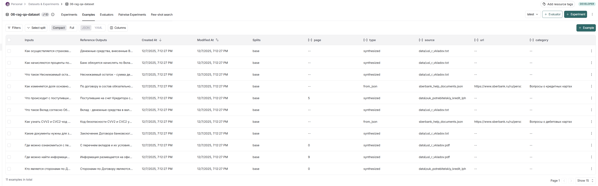

# Отчёт о выполнении задания: RAG-ассистент Сбербанка

## Название проекта и краткое описание

**Проект:** RAG-ассистент Сбербанка  
**Описание:** Telegram-бот с Retrieval-Augmented Generation (RAG) для ответов на вопросы по документам Сбербанка о кредитах и вкладах. Бот использует индексацию PDF и JSON документов, контекстный диалог с query transformation, а также оценку качества через RAGAS.

## Вариант задания

Базовый вариант.

## Используемые модели и провайдеры

Конфигурация из файла `.env`:

- **Провайдер:** OpenRouter (https://openrouter.ai/api/v1)
- **Основная LLM для генерации ответов:** `openai/gpt-oss-20b`
- **LLM для трансформации запросов:** `openai/gpt-oss-20b`
- **Модель эмбеддингов:** `openai/text-embedding-3-large`
- **LLM для оценки RAGAS:** `openai/gpt-oss-20b`
- **Эмбеддинги для оценки RAGAS:** `openai/text-embedding-3-large`

## Создание и загрузка датасета

### Как создавали датасет

Датасет создан автоматическим синтезом с помощью скрипта `src/dataset_synthesizer.py`. Для каждого PDF-документа и JSON-файла с готовыми Q&A парами LLM генерирует вопросы и ответы на основе содержимого чанков. Также в датасет включены готовые Q&A пары из файла `data/sberbank_help_documents.json`.

### Размер датасета

Датасет содержит **11 примеров** (Q&A пар), что видно по файлу `datasets/06-rag-qa-dataset.json`.

### Скриншот страницы датасета в LangSmith

### Примеры Q&A пар из датасета

Вот два примера из датасета:

1. **Вопрос:** "Кто является сторонами по Договору потребительского кредита?"  
   **Эталонный ответ:** "Сторонами по Договору являются Кредитор и Заемщик или Созаемщики."

2. **Вопрос:** "Как узнать CVV2 и CVC2-код карты?"  
   **Эталонный ответ:** "Код безопасности CVV2 и CVC2 указан на обратной стороне самой карты. Также его можно посмотреть в приложении СберБанк Онлайн: зайдите на страницу карты и нажмите на её изображение.Никогда и никому не сообщайте код безопасности вашей карты — он даёт доступ к вашим деньгам."

## Оценка качества через RAGAS

### Какие метрики используются для оценки качества

В проекте используются шесть метрик RAGAS:

1. **Faithfulness (Обоснованность)** – отсутствие галлюцинаций (ответ основан только на извлечённых документах).
2. **Answer Relevancy (Релевантность ответа)** – насколько ответ релевантен вопросу.
3. **Answer Correctness (Правильность ответа)** – общая корректность ответа (комбинация faithfulness и similarity).
4. **Answer Similarity (Похожесть на эталон)** – семантическое сходство с эталонным ответом.
5. **Context Recall (Полнота контекста)** – доля информации из ground truth, присутствующей в извлечённых документах.
6. **Context Precision (Точность поиска)** – доля извлечённых документов, релевантных вопросу.

### Фактические значения метрик

После выполнения команды `/evaluate_dataset` получены следующие средние значения:

| Метрика                           | Значение | Интерпретация    |
| --------------------------------- | -------- | ---------------- |
| Обоснованность (нет галлюцинаций) | 0.389    | 🔴 Низкое        |
| Релевантность ответа              | 0.012    | 🔴 Очень низкое  |
| Правильность ответа               | 0.390    | 🔴 Низкое        |
| Похожесть на эталон               | 0.568    | 🔴 Ниже среднего |
| Полнота контекста                 | 0.550    | 🔴 Ниже среднего |
| Точность поиска                   | 0.629    | 🟡 Среднее       |

### Интерпретация результатов

- **Обоснованность (0.389):** Система часто генерирует ответы, не основанные на предоставленных документах (галлюцинации). Это серьёзная проблема, требующая улучшения retriever и промптинга.
- **Релевантность ответа (0.012):** Крайне низкое значение указывает, что ответы почти не соответствуют заданным вопросам. Возможно, retriever извлекает нерелевантные чанки, либо LLM игнорирует контекст.
- **Правильность ответа (0.390):** Общая корректность ответов низкая, что ожидаемо из-за плохих faithfulness и similarity.
- **Похожесть на эталон (0.568):** Ответы семантически слабо совпадают с эталонными, но лучше, чем другие метрики.
- **Полнота контекста (0.550):** Retriever извлекает около половины необходимой информации из документов.
- **Точность поиска (0.629):** Лучшая метрика, но всё ещё средняя – около 63% извлечённых чанков действительно релевантны вопросу.

## Выводы

### Главные инсайты о качестве RAG системы

1. **Критически низкая релевантность и обоснованность** – основная проблема системы. Ответы часто не соответствуют вопросам и содержат галлюцинации.
2. **Retriever работает удовлетворительно по точности (0.629)**, но недостаточно хорошо по полноте (0.550). Это означает, что он находит часть нужных документов, но пропускает важную информацию.
3. **LLM, вероятно, игнорирует контекст** или неправильно его интерпретирует, что приводит к низкой faithfulness.
4. **Датасет из 11 примеров мал** для полноценной оценки, но уже показывает системные слабости.
5. **Необходимы улучшения**:
   - Настройка промптов для строгого следования контексту.
   - Увеличение размера датасета для более репрезентативной оценки.
   - Эксперименты с chunk size, overlap и количеством извлекаемых чанков (k).
   - Возможно, смена embedding-модели на более качественную.

Несмотря на низкие метрики, система демонстрирует работоспособный pipeline RAG с интеграцией LangSmith и RAGAS, что позволяет проводить итеративные улучшения на основе объективных измерений.

---

_Отчёт создан автоматически на основе данных проекта._  
_Дата генерации: 2025-12-07_
